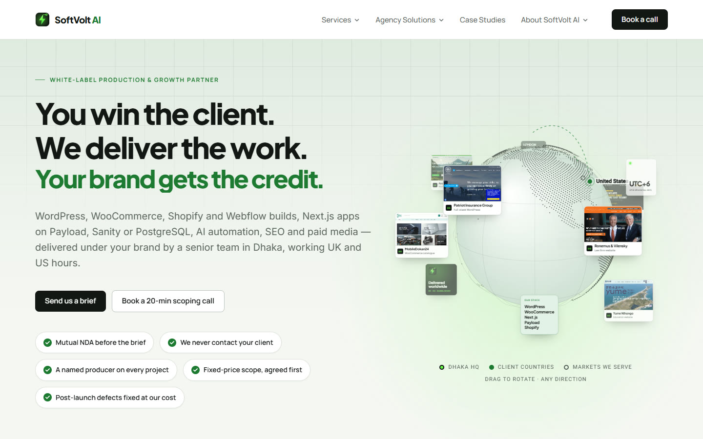

<div align="center">


# SoftVolt AI

**The white-label production & growth team behind agencies.**<br />
You win the client. We deliver the work. Your brand gets the credit.

[softvoltai.com](https://softvoltai.com) · Next.js 16 · React 19 · TypeScript · Tailwind CSS 4 · Vercel

</div>



## Contents

- [About](#about)
- [Highlights](#highlights)
- [Tech stack](#tech-stack)
- [Pages](#pages)
- [Getting started](#getting-started)
- [Environment variables](#environment-variables)
- [Deploy to Vercel](#deploy-to-vercel)
- [Project structure](#project-structure)
- [Editing content](#editing-content)
- [Design system](#design-system)
- [Motion & accessibility](#motion--accessibility)
- [SEO & security](#seo--security)
- [Before launch](#before-launch)
- [Roadmap](#roadmap)

## About

SoftVolt AI is a white-label production and growth partner for digital agencies in the United Kingdom, the United States, Canada, Australia and the European Union. The team works from Dhaka with UK and US overlap hours. Agencies keep the client, the relationship and the credit. SoftVolt AI builds, automates, grows and supports the work under the agency's brand.

This repository is the company website: a multi-page Next.js App Router site. Every word of copy lives in typed content files. Pages stay thin, and a headless CMS can replace the content layer later without touching the UI.

The services are grouped into four pillars:

| Pillar | Focus | Services |
| --- | --- | --- |
| **Build** | Websites, stores and apps | WordPress, Elementor, WordPress plugins, WooCommerce, headless WordPress + Next.js, landing pages, Next.js + Payload + PostgreSQL, Next.js + Sanity / Prismic, Next.js apps on PostgreSQL, Laravel, Shopify, Webflow |
| **Automate** | AI and workflow automation | AI automation, workflow automation, AI assistants & chat, internal tools |
| **Grow** | Campaign execution | SEO, technical SEO, local SEO, Google Ads, Meta Ads, conversion rate optimisation |
| **Support** | Keeping client sites healthy | Maintenance, security & malware cleanup, bug fixing & rescue, performance, migration, analytics & tracking |

The site follows three content rules, and the code is built around them:

- **No invented proof.** Case studies and globe cards show real, live sites the founder delivered before SoftVolt AI. Until there are real, permissioned quotes, the testimonials section shows an honest "no testimonials yet" panel.
- **Commitments instead of logos.** Where most agency sites show a logo strip, this one shows its published commitments: mutual NDA, no contact with your client, a named producer, fixed-price scopes and post-launch defects fixed at no cost. The hero chips read from the same file, so the two lists always match.
- **One sourced figure.** The build-or-buy comparison uses a single statistic (US Bureau of Labor Statistics median pay for web developers) and links to its source.

## Highlights

- **Orbit globe hero.** A canvas-drawn Earth made of 6,352 land dots: a 24,000-point Fibonacci sphere, keeping only the points that fall on Natural Earth land data. Visitors can drag it to rotate in any direction. Twelve cards orbit it: eight real client sites plus four tiles for cities, reach, stack and working hours. Arcs run from Dhaka to clients in the UK and US, and rings mark the other markets.
- **White-label, demonstrated.** Visitors type their agency name and pick a brand colour. The finished client site rebrands to match, and a lens reveals what the client never sees underneath: the staging server, the commits and the QA.
- **Live vitals.** The stack panel measures this site's performance in the visitor's own browser, using `PerformanceObserver` and the Resource Timing API. Nothing is sent anywhere and nothing is faked.
- **Process engine.** Five steps from brief to handover. The steps scroll past while a pinned panel shows the document each step produces. It uses plain `position: sticky` and an `IntersectionObserver`, with no scroll hijacking.
- **Follow-the-sun clocks.** Live local time in Dhaka, London, New York, Toronto and Sydney, rendered without hydration mismatches.
- **Four-step brief form.** Built with React Hook Form and Zod, with validation on every step, automatic time-zone detection and a honeypot spam trap. Briefs are delivered by email through Resend.
- **Case studies.** A gallery with category filters, plus a page for each project.
- **Plan cards.** Four monthly tiers, one marked "Recommended". A tier without a price shows "Let's talk" instead of a number.

## Tech stack

| Layer | Choice |
| --- | --- |
| Framework | [Next.js 16.3](https://nextjs.org): App Router, React Server Components, Turbopack |
| Language & UI | TypeScript 5.9 (strict), React 19.3 |
| Styling | [Tailwind CSS 4.3](https://tailwindcss.com) with CSS-first design tokens (`@theme` in `app/globals.css`) |
| Motion | [GSAP 3.15](https://gsap.com) (ScrollTrigger, SplitText) + `@gsap/react`, [Lenis](https://lenis.darkroom.engineering) smooth scroll |
| Forms | React Hook Form 7 + Zod 4, with one schema shared by the form and the API route |
| Email | [Resend](https://resend.com), optional: without it, briefs are logged instead |
| Fonts | Plus Jakarta Sans, Inter, Manrope and Roboto through `next/font`, self-hosted at build time |
| Tooling | pnpm 10, ESLint 9 (`eslint-config-next`) |
| Hosting | [Vercel](https://vercel.com) |

## Pages

`next build` pre-renders 59 routes as static files. The brief API is the only server function.

| Route | What it is |
| --- | --- |
| `/` | Homepage, in this order: hero → commitments → white-label demo → capability marquee → service pillars → stack & live vitals → agency protection → follow-the-sun → build-or-buy comparison → process → plans → agency types → work → team → FAQ → brief call-to-action |
| `/services` | All services, grouped by pillar |
| `/services/[slug]` | 28 service pages, each with `Service` structured data |
| `/for` | Agency solutions overview |
| `/for/[slug]` | 6 pages: digital marketing, SEO, Google Ads & PPC, branding & design, web design and full-service agencies |
| `/case-studies` | Filterable work gallery |
| `/case-studies/[slug]` | 8 case studies |
| `/rates` | Monthly plans and pricing FAQs |
| `/security` | Security & confidentiality: NDA, credential handling, data protection |
| `/partner-programme` | How an agency partnership starts and grows |
| `/about` | Story, team, coverage hours and process |
| `/contact` | The four-step brief form, plus a booking link when one is configured |
| `POST /api/brief` | Validates a brief, then emails it or logs it |
| `/sitemap.xml` · `/robots.txt` · `/opengraph-image` | Generated from the same content as the pages |

`/work` permanently redirects to `/case-studies`.

## Getting started

**Requirements:** Node.js 20.9 or newer (the site is developed on Node 22) and pnpm 10. Run `corepack enable` to use the exact pnpm version pinned in `package.json`.

```bash
git clone https://github.com/alamgirwordpress1-lab/SoftVoltAI.git
cd SoftVoltAI
pnpm install
cp .env.example .env.local   # optional: the site runs without it
pnpm dev                     # http://localhost:3000
```

| Script | What it does |
| --- | --- |
| `pnpm dev` | Starts the development server (Turbopack) |
| `pnpm build` | Builds for production: type-checks and pre-renders every page |
| `pnpm start` | Serves the production build |
| `pnpm lint` | Runs ESLint (Next 16 removed `next lint`) |
| `pnpm typecheck` | Runs `tsc --noEmit` |

> **Windows + OneDrive:** three settings make the project work in a OneDrive folder. `.npmrc` sets `node-linker=hoisted`, because junctions inside OneDrive break Turbopack's module resolution. `pnpm-workspace.yaml` stops pnpm from climbing into a parent folder's workspace. `next.config.ts` pins the Turbopack and file-tracing roots. None of them change anything on other systems or on Vercel.

## Environment variables

Every variable is optional for local development. Copy `.env.example` to `.env.local` and fill in what you need.

| Variable | Used for | If it is not set |
| --- | --- | --- |
| `NEXT_PUBLIC_SITE_URL` | Canonical URLs, sitemap, Open Graph, structured data | Falls back to `https://softvoltai.com` |
| `NEXT_PUBLIC_CAL_URL` | Booking link next to the brief form (e.g. a Cal.com event) | The link is hidden |
| `RESEND_API_KEY` | Sending briefs by email through Resend | Briefs are written to the server log, not emailed |
| `BRIEF_TO_EMAIL` | The inbox that receives briefs | Same as above |
| `BRIEF_FROM_EMAIL` | Sender address, which must be on a domain verified in Resend | Same as above |

`NEXT_PUBLIC_*` values are built into the pages at build time, so redeploy after you change them.

## Deploy to Vercel

The project deploys on Vercel with no configuration file and no build overrides.

1. In Vercel, choose **Add New → Project** and import `alamgirwordpress1-lab/SoftVoltAI` from GitHub.
2. Keep the settings Vercel detects:
   - **Framework preset:** Next.js
   - **Root directory:** `./`
   - **Install command:** `pnpm install` (for new projects, Vercel reads the v9 `pnpm-lock.yaml` with pnpm 10)
   - **Build command:** `next build`
3. Under **Environment Variables**, add the variables from the table above for the Production environment. Add them to Preview too if preview deployments should send email.
4. Click **Deploy**. From then on, every push to `main` goes to production, and every other branch or pull request gets its own preview URL.
5. Under **Settings → Domains**, add `softvoltai.com` and `www.softvoltai.com`. Then create the DNS records Vercel shows at your domain registrar.

> [!IMPORTANT]
> Set `RESEND_API_KEY`, `BRIEF_TO_EMAIL` and `BRIEF_FROM_EMAIL` before sharing the live URL. Until they are set, the brief form still tells visitors their brief was sent, but the brief only appears in the deployment's **Runtime Logs** and nobody is emailed. Verify the sending domain in Resend first.

If a Vercel build log ever shows pnpm 9, add the environment variable `ENABLE_EXPERIMENTAL_COREPACK=1`. Vercel then uses the exact pnpm version pinned in `package.json`.

Before you push, you can reproduce Vercel's build locally:

```bash
pnpm install --frozen-lockfile
pnpm build
```

## Project structure

```text
app/
├── layout.tsx               fonts, global metadata, Organization + WebSite JSON-LD, MotionRoot
├── globals.css              design tokens (@theme) and shared utility classes
├── (site)/                  every page that uses the header and footer
│   ├── page.tsx             homepage (the section order lives here)
│   ├── services/            index + [slug] template
│   ├── for/                 index + [slug] template
│   ├── case-studies/        index + [slug] template
│   └── rates/ security/ partner-programme/ about/ contact/
├── api/brief/route.ts       brief endpoint: Zod validation, then Resend or the log
└── sitemap.ts · robots.ts · opengraph-image.tsx · not-found.tsx · icon.svg · apple-icon.png
components/
├── layout/                  SiteHeader, MegaMenu, NavDropdown, SiteFooter, StickyCta, BackToTop, Logo
├── sections/                one file per page section: Hero, OrbitGlobe, EngineRoomDemo, ProcessEngine, Rates, BriefForm…
├── ui/                      Button, SectionHeading, PageHero, Chip, ArrowLink
├── seo/                     JsonLd, Breadcrumbs (with BreadcrumbList data)
└── motion/                  MotionRoot: Lenis, anchor scrolling, reveal on scroll
content/                     ALL copy and data, typed. Edit words here, never in components
lib/
├── cms/                     content access layer (cms.getX()) and shared types
├── forms/brief-schema.ts    Zod schema shared by the brief form and the API route
├── globe/land-dots.ts       generated globe coordinates (do not edit by hand)
├── motion/gsap.ts           GSAP plugin registration + reduced-motion helper
├── seo/schema.ts            schema.org builders
└── hooks/useNow.ts          hydration-safe clock
public/
├── brand/                   logo mark and lockups (SVG, PNG)
├── clients/                 screenshots of delivered client sites
└── founder.png · team-likhon.png · hero-grid.svg
docs/                        images used in this README
```

## Editing content

Pages never import from `content/` directly. They call `cms` from `lib/cms`, which currently returns the typed local data. A future CMS adapter (WordPress through WPGraphQL, or Payload) only needs to implement the same functions.

| To change… | Edit |
| --- | --- |
| Company details, navigation, footer links, social profiles, calls to action | `content/site.ts` |
| Services and their pillars | `content/pillars.ts` (the list) + `content/service-details-*.ts` (the page copy) |
| Agency solution pages | `content/agency-types.ts` |
| Case studies and gallery filters | `content/work.ts` + a screenshot in `public/clients/` |
| Globe cards and map markers | `content/clients.ts` |
| Commitments and protection clauses | `content/promises.ts` |
| Process steps and turnarounds | `content/process.ts` |
| Tech stack, city clocks, plans and prices | `content/stack.ts` |
| Build-or-buy comparison | `content/comparison.ts` |
| Team cards | `content/founder.ts` + a photo in `public/` |
| FAQs | `content/faqs.ts` |
| Testimonials | `content/testimonials.ts` (while empty, the honest placeholder panel shows) |
| Brief form platforms and budgets | `lib/forms/brief-schema.ts` |

To add a service, add one entry to `pillars.ts` and its copy to the matching details file. Its page, sitemap entry, navigation link and structured data are all generated from those two entries.

## Design system

The design tokens live in `app/globals.css` under `@theme`, so every Tailwind colour, font and radius utility uses them.

| Token | Value | Role |
| --- | --- | --- |
| `paper` | `#f6f7f4` | Page background |
| `ink` | `#121614` | Text and primary buttons |
| `muted` | `#5b645e` | Secondary text |
| `accent` | `#1e7a32` | Approval green on light sections |
| `volt` | `#65f545` | Accent for the dark "engine room" sections only, never used as text on paper |
| `er-bg` | `#0e1411` | Engine room background |

- **Type:** Plus Jakarta Sans for headings, Inter for body copy, Manrope for navigation, buttons and labels, and Roboto for numbers and metadata.
- **Layout:** content sits in `.container-x` (up to 1500px wide). The header and the page heroes share the full-bleed `.wide-x` rail (up to 1920px), so their edges line up.
- **Rhythm:** sections are spaced by `--section-y: clamp(56px, 5.5vw, 84px)`. White `.section-alt` bands alternate with the paper sections, so no two pale sections touch.
- **Buttons:** one style across the site, a solid ink button and its outline partner. Both invert on dark sections.
- **Logo:** an ink tile holding a volt bolt, with a spark gap to a signal node (`components/layout/Logo.tsx`, `app/icon.svg`, `public/brand/`).

## Motion & accessibility

- `MotionRoot` drives Lenis smooth scrolling from GSAP's ticker, scrolls same-page anchor links with an offset for the header, and reveals `[data-reveal]` elements with a single `IntersectionObserver`.
- Content stays visible without JavaScript, and anything already on screen at load is never hidden and faded back in.
- Every animation respects `prefers-reduced-motion`: Lenis is switched off, timelines are skipped, reveals are instant and the globe does not spin on its own.
- The markup is semantic: the comparison is a real `<table>`, the FAQ uses native `<details>` elements, focus rings are visible, and form fields have labels and `aria-invalid` states.

## SEO & security

- Each page has its own title, description, canonical URL and Open Graph data, with `en-GB` as the site language.
- Structured data: `Organization` + `ProfessionalService` and `WebSite` on every page, `Service` on each service page, and `BreadcrumbList` on every inner page.
- `sitemap.xml` is built from the same content as the pages, so new services and case studies are listed automatically.
- `robots.txt` keeps crawlers out of `/api/` and explicitly allows OpenAI's search crawler.
- A 1200×630 Open Graph image is generated with `next/og`.
- Every response carries `X-Content-Type-Options`, `X-Frame-Options`, `Referrer-Policy` and `Permissions-Policy` headers (set in `next.config.ts`).
- The brief API checks every field on the server with the same Zod schema the form uses. The emailed brief has the visitor's address as its reply-to.

## Before launch

Search the code for `TODO(owner)`. Each marker is a public commitment to confirm or a placeholder to replace:

- [ ] `content/stack.ts`: **the plan prices, limits and turnarounds are placeholders.** Replace them with costed figures.
- [ ] `content/promises.ts`, `content/process.ts`, `content/comparison.ts`, `app/(site)/rates/page.tsx`: confirm every commitment and turnaround.
- [ ] `components/sections/FollowTheSun.tsx`: confirm the coverage hours.
- [ ] `content/site.ts`: create the `hello@softvoltai.com` mailbox and add the company's own social profiles.
- [ ] `content/founder.ts`: add team quotes, in each person's own words.
- [ ] `content/testimonials.ts`: add real, permissioned quotes only.
- [ ] Vercel: set the Resend variables and `NEXT_PUBLIC_CAL_URL`, then connect the domain.

## Roadmap

1. Cookieless analytics (Plausible), plus a consent gate before GTM, GA4 or Clarity load.
2. Headless WordPress (WPGraphQL + ACF) for a blog and case studies, connected through `lib/cms`.
3. An agency portal on Payload 3: project submission, status tracking, files and reports.

## Rights

© 2026 SoftVolt AI. All rights reserved. The source code is public so people can read it, but it has no open-source licence. The SoftVolt AI name, logo, copy and team photos may not be reused. Client website screenshots belong to their owners.
